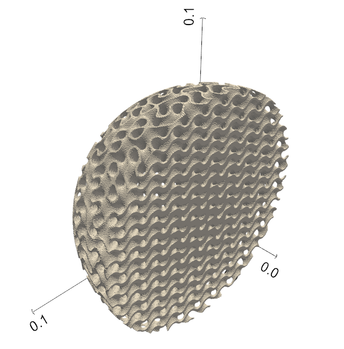

# EuCAP_2026_Luneburg

Paper: "_Fourier Series-Based Optimization of Gradient Index Lens Permittivity Profiles Within Manufacturing Limits_", presented at the 2026 20th European Conference on Antennas and Propagation (EuCAP). 

Note that this code is only provided for convenience & has not been peer reviewed.

## Requirements

This code is built on [LisbonTPMS](https://github.com/JorgeESantos/LisbonTPMS-tool).

This library works for Python 3.10 up to 3.12 and is dependent Numpy, Scipy, scikit-image, PoreSpy and PyVista. See the [LisbonTPMS](https://github.com/JorgeESantos/LisbonTPMS-tool) repository for further details.

## Usage

Create a virtual environment and activate it by running the following in a terminal:

    python -m venv .venv
    source .venv/bin/activate   # on Windows: .venv\Scripts\activate

LisbonTPMS can then be installed by running:

    pip install -r requirements.txt

After this, the TPMS Luneburg lens can be synthesized by running the **EuCAP_Luneburg.py** script.

    python EuCAP_Luneburg.py

The resulting TPMS hemisphere is shown below. Alternatively, the **LL\_optimized.3mf** file can be opened in PrusaSlicer to directly print the Luneburg lens ([LFS](https://git-lfs.com/) is required due to the large file size).

